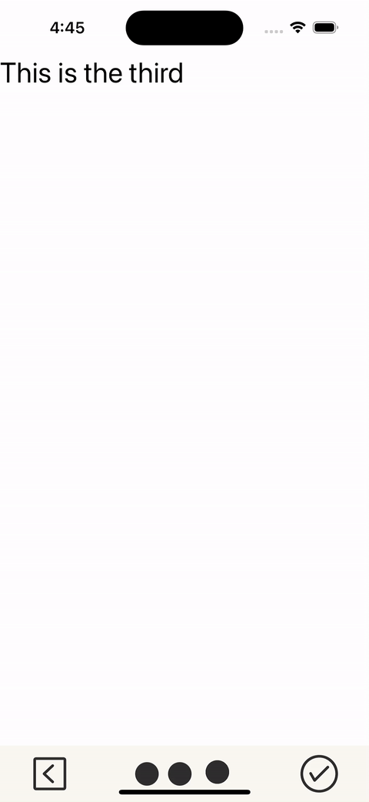

# react-native-onboarding

A simple and fully customizable React Native component that implements a onboarding stepper.

### demo:


## Installation

### yarn

```shell
yarn add stepper-react-native
```

### npm
```shell
npm i stepper-react-native
```

## Usage
```javascript
import {Onboarding} from 'stepper-react-native'

//components
import { StatusBar } from 'expo-status-bar';
import { StyleSheet,  View } from 'react-native';
import Step1 from './src/components/step1';
import {Onboarding, ScreensType} from 'stepper-react-native'

export default function App() {
  const steps: ScreensType[] = [{
    scrollable: true,
    screen: <Step1 description='This is the first' />
  },
    {
      scrollable: false,
      screen: <Step1 description='This is the second' />
    },
    {
      scrollable: false,
      screen: <Step1 description='This is the third' />
    }];

  const handleOnNext = () => {
    console.log("ON next");
  };
  const handleOnBack = () => {
    console.log("ON BAck");
  };
  const handleFinish = () => {
    console.log("Oh Finish...");
  };

  return (
    <View style={styles.container}>
      <View style={styles.container}>
        <Onboarding
          screens={steps}
          onNext={() => handleOnNext()}
          onPrevious={() => handleOnBack()}
          onFinish={() => handleFinish()}
        />
      </View>
      <StatusBar style="auto" />
    </View>
  );
}

const styles = StyleSheet.create({
  container: {
    flex: 1,
    backgroundColor: '#fff',
    alignItems: 'center',
    justifyContent: 'center',
  },
});

```

### Props 

```typescript
import {ViewStyle} from "react-native";
import React from "react";

type ScreensType = {
	scrollable?: boolean;
	screen: React.ReactElement
}

type ActionsBoardingType = {
	onFinish?: () => void;
	onNext?: () => void;
	onPrevious?: () => void;
	footerStyle?: ViewStyle;
}

type ConfigTypes = {
	colorIcons?: string;
	containerStyle?: ViewStyle;
	sizeIcons?: number
}

type MainPropsType = ActionsBoardingType & {
	screens: ScreensType[];
	config?: ConfigTypes
}

```

